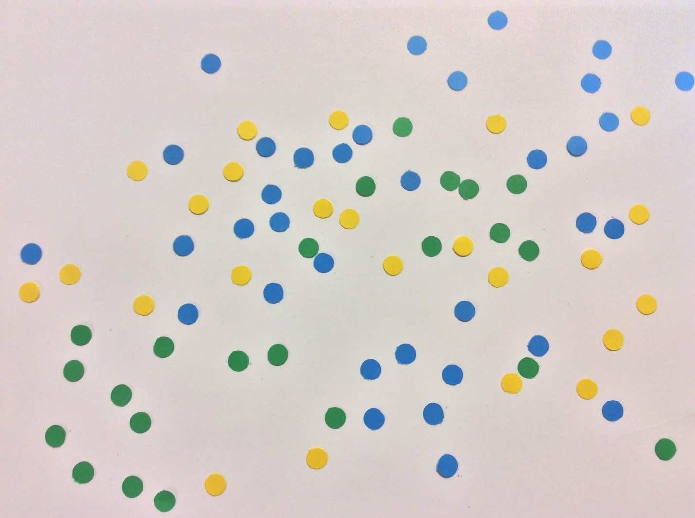
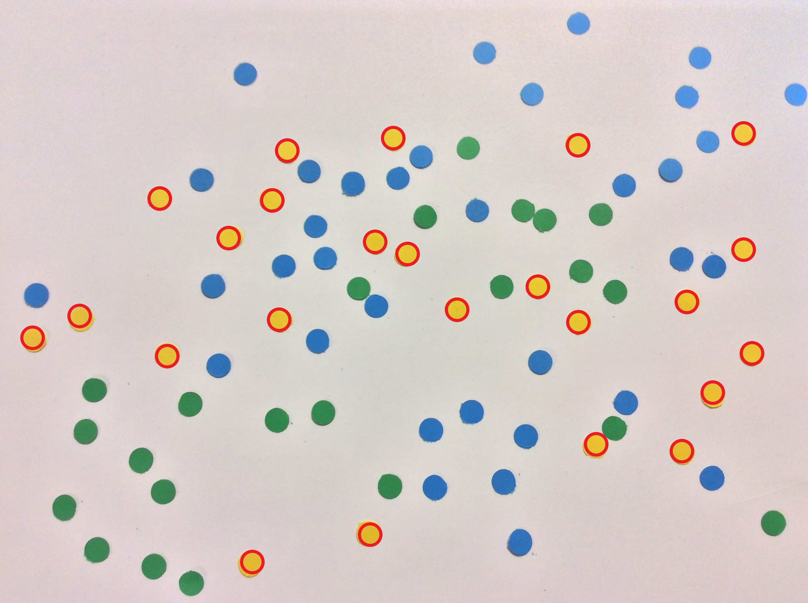

# sepratation-of-object-on-color-basis

this programm will seprate the yellow dots from other colored dots, put a circle around them and also count them 

        FROM THIS
        TO 
        THIS
            \/

